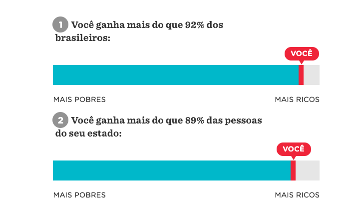
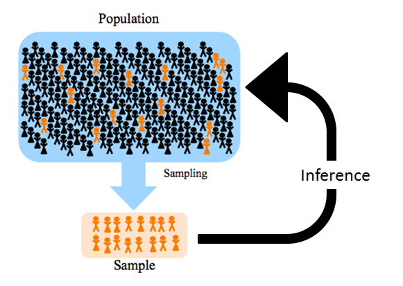
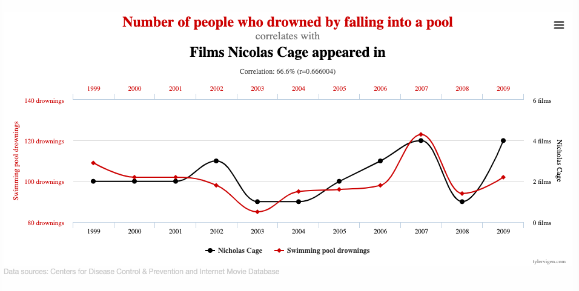
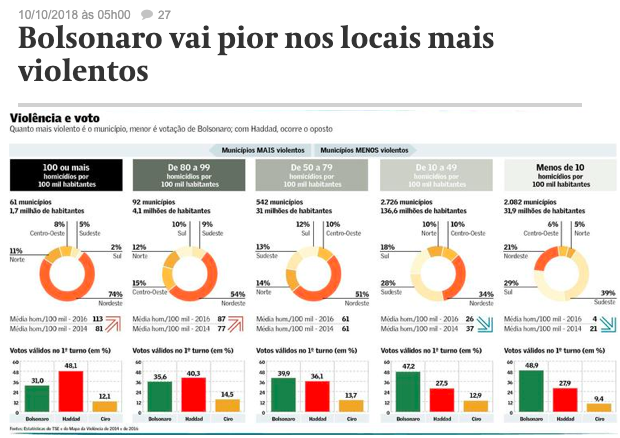
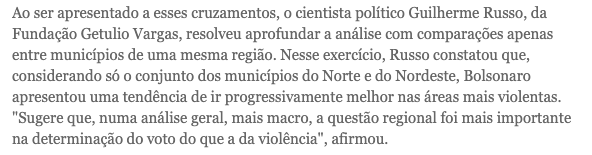
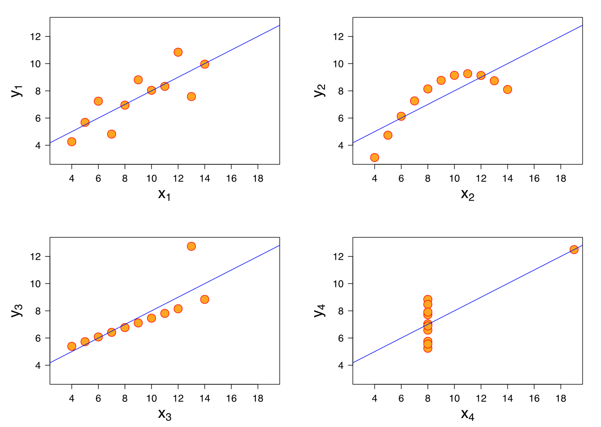

```{r setup, include=FALSE}
knitr::opts_chunk$set(echo = TRUE)
library(dplyr)
library(ggplot2)
```

# Estatística básica

--

- Por que é importante?

--

- Média, mediana e moda

--

- Porcentagem e taxas

--

- Probabilidade

--

- Distribuições
    - Normal
    - Uniforme

--
- Inferência: população e amostra

--

- Causalidade e falácia ecológica


---

# Por que é importante?

--
- É fácil chegar a conclusões falsas a partir de dados reais
--

- Pode mudar completamente seu lide
--

- Ajuda a escrever de forma mais clara

---
background-image: url(imgs/calvin.png)
background-size: contain

# Por que é importante?

---
class: inverse

## Exemplo:

A cidade X teve 50 assassinatos neste ano. A cidade Y também teve 50 assassinatos.<br>
Há 5 anos, X teve 29 assassinatos e Y teve 42.

A cidade X ficou mais perigosa que a cidade Y em comparação a 5 anos atrás?

--
<br><br><br>
**Falta informação!**
<br><br><br>
--

Neste ano, a população da cidade X é de 800 mil habitantes. Y tem 600 mil habitantes.<br>
Há 5 anos, as populações de X e de Y eram 450 mil e 550 mil, respectivamente.

Então, se considerarmos os assassinatos per capita, temos:
- Neste ano, 6.25 assassinatos a cada 100 mil habitantes em X e 8.33 em Y
- Há 5 anos, 6.44 assassinatos a cada 100 mil habitantes em X e 7.64 em Y


---


# Média, mediana e moda

### O que significa média?

--
cidadão médio? <br>

--
salário médio? <br><br>

--
Às vezes, usamos a palavra média mas queremos dizer mediana, moda...

---

# Média, mediana e moda

**Média**: Soma de todos os valores dividida pela quantidade. É mais sensível a valores extremos.

**Mediana**: Divide os dados na metade. Metade dos valores é menor que a mediana (e metade é maior).

**Moda**: Valor mais comum. Um conjunto de dados pode ter mais de uma moda.

---
background-image: url(imgs/mean.jpg)
background-size: contain

---

background-image: url(imgs/mean2.jpg)
background-size: contain

---

# Média, mediana e moda

```{r echo=F, fig.height = 5}
notas <- c(4.25,0,6.75,2.75,3.25,3.25,4,7.25,1.5,2.25,0.5,1.75,0.5,0,3.5,0,7.5,5.25,1.75,1.5,2.5,3.25,6.75,6,6.5,5,2,2.5,2.75,6.75,8,3,8.5,1.5,9,3.25,2,5.75,3,3)
table(notas) %>% as.data.frame()
```
---
```{r echo = F}
hist(notas)
cat("Média = ", mean(notas))
cat("Mediana = ", median(notas))
cat("Moda = ", names(sort(table(notas), T)[1]))
```

---
background-image: url(imgs/median.png)
background-size: contain

---
background-image: url(imgs/median2.png)
background-size: contain
---
background-image: url(imgs/mode.png)
background-size: contain

---
background-image: url(imgs/mode2.png)
background-size: contain
---


# Porcentagens e taxas

- Comparação de quantidades
--

- Crescimento ao longo do tempo
--

- Aumento de 10% $\neq$ aumento de 10 pontos percentuais
--

<br><br>
A diferença entre percentual e ponto percentual é confusa quando a quantidade que estamos medindo em si é uma porcentagem.

Por exemplo: **_Aprovação de Bolsonaro caiu de 52% para 36%_**

- A diferença é de 16 pontos percentuais ( 52 - 36 = 16 )
- Mas a diminuição é de 30,8% ( (52 - 36)/52 )

---

# Probabilidade

### Uma questão de contagem
número de resultados de interesse dividido pelo número de resultados possíveis
--

- Se eu jogar um dado, qual a probabilidade de obter um 6? E 1?
--
<br><br>
Resultados possíveis:   `1, 2, 3, 4, 5, 6` (total = 6)<br>
Resultado de interesse:   `6` (total = 1) <br><br>
--
Probabilidade de tirar um 6:   `1/6 = 0,167` <br><br>(ou, ainda, 16,7%) <br>

---
# Probabilidade 

- Se eu jogar dois dados e somar, qual a probabilidade de tirar 1? E 6?<br>
--
<br>
Resultados possíveis para o primeiro dado: `1, 2, 3, 4, 5, 6` <br>
Resultados possíveis para o segundo dado: `1, 2, 3, 4, 5, 6` <br><br>
--
Somas possíveis: <br>
Fixando 1 no primeiro dado: `2, 3, 4, 5, 6, 7` <br>
Fixando 2 no primeiro dado: `3, 4, 5, 6, 7, 8` <br>
Fixando 3 no primeiro dado: `4, 5, 6, 7, 8, 9` <br> 
Fixando 4 no primeiro dado: `5, 6, 7, 8, 9, 10` <br>
Fixando 5 no primeiro dado: `6, 7, 8, 9, 10, 11` <br>
Fixando 6 no primeiro dado: `7, 8, 9, 10, 11, 12` <br><br>
--
De quantas formas é possível tirar 1? __Zero__ <br>
Logo, a probabilidade de tirar 1 é igual a 0.<br><br>
--
De quantas formas é possível tirar 6? __5__ <br>
Logo, a probabilidade de tirar 6 é igual a 5 dividido por 36 (número total de resultados possíveis), ou seja, 13,9%


--
- Probabilidade é a mesma coisa que proporção? 
--
_ Quase_


---
# Distribuições

### Distribuição uniforme
Como o nome diz, as probabilidades são distribuídas uniformemente entre todos os possíveis resultados.<br>
Quando jogamos um dado, assumimos que todas as faces tem a mesma probabilidade. <br><br>
--

```{r echo=F, fig.height = 4, fig.align="center"}
data.frame(face = c(1,2,3,4,5,6), prob = rep(1/6, 6)) %>% 
  ggplot(aes(as.factor(face), prob)) + geom_bar(stat="identity", width = 0.99) + 
  labs(title = "Probabilidade de cada face de um dado", x = "face")
```


---
# Distribuições

### Distribuição normal
A distribuição das probabilidades é mais concentrada no centro.<br>
Quando consideramos a soma de dois dados, a distribuição _tende_ a ser normal. <br>
Quanto mais vezes jogarmos os dados, estaremos mais próximos de uma distribuição normal teórica. <br><br>
--
```{r echo=F, fig.height=4, fig.align="center"}
ggplot(data.frame(x = c(2, 12)), aes(x = x)) +
        stat_function(fun = dnorm, args = list(7, 2)) +
  scale_x_discrete(limits=c(2,3,4,5,6,7,8,9,10,11,12)) +
  labs(title =  "Distribuição normal teórica")
```
---
# Distribuições

Vamos simular 10 lançamentos
```{r fig.height=5, fig.align="center"}
dado1 <- floor(runif(10, 1, 7))
dado2 <- floor(runif(10, 1, 7))
hist(dado1+dado2)
```
---
# Distribuições

100 lançamentos:
```{r fig.height=5, fig.align="center"}
dado1 <- floor(runif(100, 1, 7))
dado2 <- floor(runif(100, 1, 7))
hist(dado1+dado2)
```

---
# Distribuições

10.000 lançamentos:
```{r fig.height=5, fig.align="center"}
dado1 <- floor(runif(10000, 1, 7))
dado2 <- floor(runif(10000, 1, 7))
hist(dado1+dado2)
```

---
# Distribuições

Entender a distribuição dos dados ajuda a avaliar questões que surgem na análise dos dados:
  
- Frequência com que os valores (ou intervalos de valores) estão distribuídos
- Valores mais comuns, mínimos, máximos
- Variabilidade
- Valores discrepantes
- Simetria

--

Ferramentas importantes:
  
- Gráficos
- Tabelas
- Medidas resumo (média, mediana...)
---
class: inverse
### Exemplo bom: lidando com distribuição
[O seu salário diante da realidade brasileira](https://www.nexojornal.com.br/interativo/2016/01/11/O-seu-sal%C3%A1rio-diante-da-realidade-brasileira)
--
</img>

--

- Dá ideia da distribuição de salários
- Compara valores individuais, e não valores resumidos (média)
---
class: inverse
### Exemplo confuso: comparando números em escalas diferentes

#### Em cinco dias, PM mata na Grande SP mais do que a média diária no estado
</img>

---
class: inverse
### Exemplo confuso: comparando números em escalas diferentes
#### Em cinco dias, PM mata na Grande SP mais do que a média diária no estado

- No título, dá a impressão de estar comparando a soma de mortes de 5 dias (16) com a média diária (2 por dia)
- Comparação da média de 5 dias com a média de um trimestre
- Populações diferentes


```{r fig.height=4, fig.align="center", echo=F}
data.frame(ano=c(rep(2019,3), rep(2018,3)), mes=rep(c("jan", "fev", "mar"),2),
           mortes = c(67,52,76,61,59,52)) %>% 
  ggplot(aes(x=mes, y=mortes, fill=as.factor(ano), color=as.factor(ano), group=as.factor(ano))) + geom_line() +
  labs(title = "Mortos pela PM nos primeiros trimestres de 2019 e 2018", x= "mês")
```

---
# Inferência: população e amostra
.center[]

---
# Inferência: população e amostra

#### Amostra: subconjunto de uma população
#### População: basicamente todo mundo

 Conclusões a partir da amostra extrapoladas à população
.center[]


---

# Causalidade e falácia ecológica

## Causalidade?
--

- É muito fácil chegar a conclusões não necessariamente verdadeiras
--

-- Causalidade: se duas coisas estão relacionadas, uma influencia a outra? Causa e efeito?

---
## Causalidade?

<br>
Mais aqui: [Spurrious Correltions](http://tylervigen.com/spurious-correlations)

---
class: inverse
## Causalidade?

Nem sempre é tão óbvio. Na vida real, é _muito_ mais sutil.

.center[]

---
class: inverse
## Causalidade?

.center[]

Ótima discussão exatamente sobre isso [aqui](https://twitter.com/guilhermejd1/status/1163455886175690752)

---
## Falácia ecológica: conclusões sobre indivíduos a partir de grupos


<iframe width="760" height="415" src="https://www.youtube.com/embed/RmYIpnzbQtM" frameborder="0" allow="accelerometer; autoplay; encrypted-media; gyroscope; picture-in-picture" allowfullscreen></iframe>

---
class: inverse, center
## Última curiosidade para te convencer a <br>olhar os dados

<br>
Quarteto de Ascombe

---

# Referências
- [Khan Academy - Estatística e Probabilidade](https://pt.khanacademy.org/math/statistics-probability)
- [Curso STAT 414, da Penn State](https://onlinecourses.science.psu.edu/stat414/)
- [The Curious Journalist's Guide to Data, Jonathan Stray](https://towcenter.gitbooks.io/curious-journalist-s-guide-to-data/)
- [Statistics every writer should know](https://www.robertniles.com/stats/)

---
class: inverse, middle, center

# Obrigada!

Me encontre no 
[`r anicon::faa("github", animate="vertical")` Github](https://github.com/rmhirota) ou no [`r anicon::faa("twitter", animate="float")` Twitter](https://twitter.com/renata_mh)
