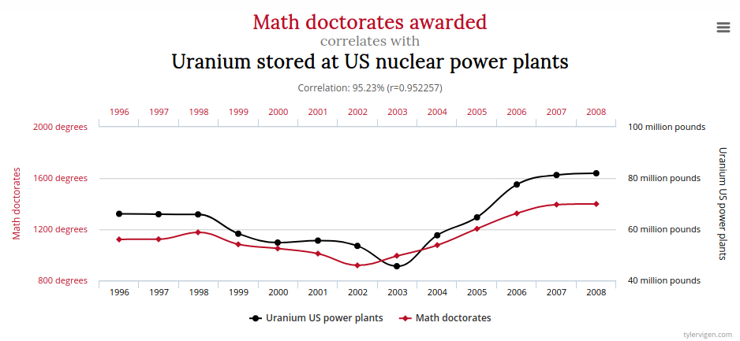
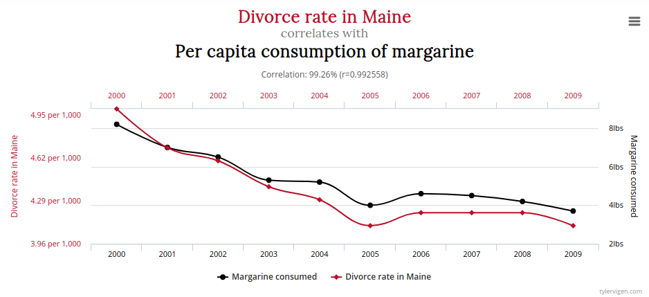

```{r setup, include=FALSE}
knitr::opts_chunk$set(echo = TRUE, warning = FALSE, message = FALSE)
library(dplyr)
library(ggplot2)
```

# Olá!

.pull-left[
```{r out.width = "220", fig.align = "left", echo = FALSE}
knitr::include_graphics("imgs/renata.jpg")
```
]

.pull-right[
**Renata Hirota** é jornalista de dados, formada na ECA-USP e graduanda em estatística no IME-USP. Lida com dados desde 2017 e atualmente trabalha na Associação Brasileira de Jurimetria. Colabora também com o Núcleo Jornalismo e Science Pulse, iniciativa do Volt Data Lab que visa aproximar jornalistas e cientistas. Faz parte da comunidade R-Ladies São Paulo, que promove a diversidade de gênero na comunidade da linguagem de programação R.


`r anicon::faa("github", animate="vertical")`Github: [rmhirota](https://github.com/rmhirota)
`r anicon::faa("twitter", animate="float")`Twitter: [@renata_mh](https://twitter.com/renata_mh)
]

---
# R-Ladies

## O que é?

R-Ladies é uma organização mundial que promove a diversidade de gênero na comunidade da linguagem R.

## Como?

Através de meetups e mentorias em um ambiente seguro e amigável.

Nosso principal objetivo é promover a linguagem computacional estatística R compartilhando conhecimento, assim, quem tiver interesse na linguagem será bem-vinda, independente do nível de conhecimento.

---
# R-Ladies

## Para quem?

Nosso principal público-alvo são as pessoas que se identificam com o gênero feminino, portanto, mulheres cis, mulheres trans, bem como pessoas não-binárias e queer.

## Missão

Como uma iniciativa de diversidade, a missão das R-Ladies é alcançar uma representação proporcional de pessoas de gêneros atualmente sub-representados na comunidade R, incentivando, inspirando e capacitando-as.


[About us - R-Ladies](https://rladies.org/about-us/)
[Meetup R-Ladies São Paulo](https://www.meetup.com/rladies-sao-paulo/)
---

background-image: url(imgs/rladies.png)
background-size: contain

---

# Índice


- Por que é importante?
- Média, mediana e moda
- Porcentagem e taxas
- Armadilhas com dados
- Boas práticas gerais


---
background-image: url(imgs/calvin.png)
background-size: contain

# Por que é importante?

---
# Por que é importante?

- É fácil chegar a conclusões falsas a partir de dados reais
- Pode mudar completamente seu lide
- Ajuda a escrever de forma mais clara

---
background-image: url(imgs/covid.jpeg)
background-size: contain

---
class: inverse
background-image: url(imgs/media_movel.png)

# Média, mediana e moda

---
# Média, mediana e moda

### O que significa média?


pessoa média?
salário médio?


Às vezes, usamos a palavra **média**, mas os conceitos mais adequados à situação são **mediana** ou **moda**.

---

# Média, mediana e moda

**Média**: Soma de todos os valores dividida pela quantidade. É mais sensível a valores extremos.

**Mediana**: Divide os dados na metade. Metade dos valores é menor que a mediana (e metade é maior).

**Moda**: Valor mais comum. Um conjunto de dados pode ter mais de uma moda.

---


background-image: url(imgs/mean.jpg)
background-size: contain

---

background-image: url(imgs/mean2.jpg)
background-size: contain

---
background-image: url(imgs/median.png)
background-size: contain

---
background-image: url(imgs/median2.png)
background-size: contain
---
background-image: url(imgs/mode.png)
background-size: contain

---
background-image: url(imgs/mode2.png)
background-size: contain
---
class: inverse
background-image: url(imgs/prop.png)
background-size: contain

# Porcentagens e taxas

---
# Porcentagens e taxas

- Comparação de quantidades
- Crescimento ao longo do tempo
- Porcentagem $\neq$ pontos percentuais

--

<br><br>
A diferença entre porcentagem e ponto percentual é confusa quando a quantidade que estamos medindo em si é uma porcentagem.

Por exemplo: **_Redução de uma taxa de 52% para 36%_**

- A diferença é de 16 pontos percentuais $(52 - 36 = 16)$
- Mas a diminuição é de 30,8%, pois $\frac{36 - 52}{52} = -0,308$

---
class: inverse, middle, center
# Armadilhas com dados

.center[]

---

# Armadilhas com dados

## Causalidade?

- É fácil chegar a conclusões não necessariamente verdadeiras
- Causalidade: se duas coisas estão relacionadas, uma influencia a outra? Causa e efeito?

---
## Causalidade?

<br>

---
## Causalidade?

<br>

---
## Causalidade?

<br>
Mais aqui: [Spurrious Correltions](http://tylervigen.com/spurious-correlations)

---
## Causalidade?

Nem sempre é tão óbvio. Na vida real, é _muito_ mais sutil.

.center[]

---
class: middle

_Ao ser apresentado a esses cruzamentos, o cientista político Guilherme Russo, da Fundação Getulio Vargas, resolveu aprofundar a análise com comparações apenas entre municípios de uma mesma região. Nesse exercício, Russo constatou que, considerando só o conjunto dos municípios do Norte e do Nordeste, Bolsonaro apresentou uma tendência de ir progressivamente melhor nas áreas mais violentas. "Sugere que, numa análise geral, mais macro, a questão regional foi mais importante na determinação do voto do que a da violência", afirmou._


[Bolsonaro vai pior nos locais mais violentos - Valor Econômico](https://www.valor.com.br/node/5914559)

---
## Falácia ecológica: conclusões sobre indivíduos a partir de grupos


<iframe width="760" height="415" src="https://www.youtube.com/embed/RmYIpnzbQtM" frameborder="0" allow="accelerometer; autoplay; encrypted-media; gyroscope; picture-in-picture" allowfullscreen></iframe>

---
class: inverse, middle, center

# Algumas boas práticas

---
## **Olhe** os dados

<br>
Quarteto de Ascombe

---
## **Olhe** os dados

<blockquote class="twitter-tweet"><p lang="en" dir="ltr">Always visualize your data! (Thanks to <a href="https://twitter.com/AlbertoCairo?ref_src=twsrc%5Etfw">@albertocairo</a> for the artwork 😀) <a href="https://t.co/8D8sgLLqB5">pic.twitter.com/8D8sgLLqB5</a></p>&mdash; Justin Matejka (@JustinMatejka) <a href="https://twitter.com/JustinMatejka/status/770682771656368128?ref_src=twsrc%5Etfw">August 30, 2016</a></blockquote> <script async src="https://platform.twitter.com/widgets.js" charset="utf-8"></script>


---
## Pense na **distribuição**

[O seu salário diante da realidade brasileira](https://www.nexojornal.com.br/interativo/2016/01/11/O-seu-sal%C3%A1rio-diante-da-realidade-brasileira)

</img>

- Dá ideia da distribuição de salários
- Compara valores individuais, e não valores resumidos (média)
---

## Evite confusão

[Em cinco dias, PM mata na Grande SP mais do que a média diária no estado](https://noticias.uol.com.br/cotidiano/ultimas-noticias/2019/04/03/em-cinco-dias-pm-mata-na-grande-sp-mais-do-que-a-media-diaria-no-estado.htm)
</img>

---
## Evite confusão

As comparações são equivalentes?

--

- No título, dá a impressão de estar comparando a soma de mortes de 5 dias (16) com a média diária (2 por dia)
- Comparação da média de 5 dias com a média de um trimestre
- Populações diferentes (Grande SP vs. estado de SP)

---
## Evite confusão

 Gráficos ajudam!

```{r fig.height=6, fig.width=10, fig.align="center", echo=F}
da <- tibble::tibble(
  data = as.Date(c("2018-01-01", "2018-02-01", "2018-03-01", "2019-01-01", "2019-02-01", "2019-03-01")),
  mortes = c(61, 59, 52, 67, 52, 76)
) %>%
  dplyr::mutate(
    ano = lubridate::year(data),
    mes = lubridate::month(data)
  )

da %>%
  mutate(ano = as.factor(ano), mes = as.factor(mes)) %>%
  ggplot(aes(x = mes, y = mortes, fill = ano, group = ano)) +
  geom_col(position = "dodge") +
  labs(title = "Mortos pela PM em SP", x = "") +
  theme_minimal() +
  scale_x_discrete(labels=c("1" = "janeiro", "2" = "fevereiro", "3" = "março")) +
  scale_fill_viridis_d(begin = 0.1, end = 0.6)

```

---
# Resumindo

- Se for resumir seus dados, veja o que faz mais sentido: média? mediana?
- Verifique qual o _tipo_ dos seus dados e que gráficos são mais adequados
- Pense no contexto dos dados: são uma amostra? Qual a incerteza associada?
- Os dados permitem fazer extrapolações?
- Análise exploratória

---

# Referências
- [Khan Academy - Estatística e Probabilidade](https://pt.khanacademy.org/math/statistics-probability)
- [Curso STAT 414, da Penn State](https://onlinecourses.science.psu.edu/stat414/)
- [The Curious Journalist's Guide to Data, Jonathan Stray](https://towcenter.gitbooks.io/curious-journalist-s-guide-to-data/)
- [Statistics every writer should know](https://www.robertniles.com/stats/)
- [Storytelling with data](http://www.storytellingwithdata.com)

---
class: inverse, middle, center

# Obrigada!

**Renata Hirota**

`r anicon::faa("github", animate="vertical")`Github: [rmhirota](https://github.com/rmhirota)<br>
`r anicon::faa("twitter", animate="float")`Twitter: [@renata_mh](https://twitter.com/renata_mh)<br><br>


