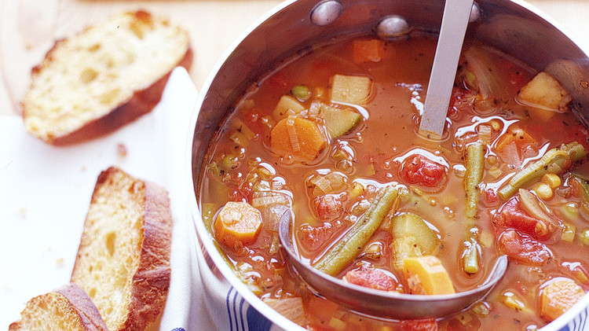

```{r setup, include=FALSE}
knitr::opts_chunk$set(echo = TRUE)
library(dplyr)
library(ggplot2)
```

# Quem somos

.pull-left[
```{r out.width = "220", fig.align = "left", echo = FALSE}

```
]

.pull-right[
**Renata Hirota** é jornalista de dados, formada na ECA-USP e graduanda em estatística no IME-USP. Lida com dados desde 2017 e atualmente trabalha na Associação Brasileira de Jurimetria. Colabora também com o Núcleo Jornalismo e Science Pulse, iniciativa do Volt Data Lab que visa aproximar jornalistas e cientistas. Faz parte da comunidade R-Ladies São Paulo, que promove a diversidade de gênero na comunidade da linguagem de programação R.


`r anicon::faa("github", animate="vertical")`Github: [rmhirota](https://github.com/rmhirota)  
`r anicon::faa("twitter", animate="float")`Twitter: [@renata_mh](https://twitter.com/renata_mh)
]

---
# Quem somos

.pull-left[
```{r out.width = "220", fig.align = "right", echo = FALSE}

```
]

.pull-right[
**Maria Marinho** é formada em Processamento de Dados, bacharela e licenciada em Matemática com ênfase em Informática, pós graduada em Educação Matemática. Atuou na área de TI como Desenvolvedora de Sistemas e atualmente é Cientista de Dados na SulAmérica. Faz parte das comunidades R-Ladies e PyLadies São Paulo.

`r anicon::faa("at", animate="vertical")`Email: mariamarinhos@gmail.com
`r anicon::faa("github", animate="float")`Github: [MaryMS](https://github.com/MaryMS)
]

---

# Estatística básica


- Por que é importante?
- Média, mediana e moda
- Porcentagem e taxas
- Tipos de Dados
- Tipos de Gráficos
- Inferência: população e amostra
- Armadilhas com dados


---
background-image: url(imgs/calvin.png)
background-size: contain

# Por que é importante?

---
# Por que é importante?

- É fácil chegar a conclusões falsas a partir de dados reais
- Pode mudar completamente seu lide
- Ajuda a escrever de forma mais clara

---
background-image: url(imgs/covid_jpeg)

# Por que é importante?

---
class: inverse
background-image: url(imgs/media_movel.png)

# Média, mediana e moda

---
# Média, mediana e moda

### O que significa média?

--
pessoa média?  
salário médio?  
  
  
Às vezes, usamos a palavra **média**, mas os conceitos mais adequados à situação são **mediana** ou **moda**.

---

# Média, mediana e moda

**Média**: Soma de todos os valores dividida pela quantidade. É mais sensível a valores extremos.

**Mediana**: Divide os dados na metade. Metade dos valores é menor que a mediana (e metade é maior).

**Moda**: Valor mais comum. Um conjunto de dados pode ter mais de uma moda.

---
# Média, mediana e moda

**Média móvel**: Média utilizada em séries temporais que considera uma janela "móvel" para fazer o cálculo. 

```{r echo = FALSE}
da <- data.table::fread("dados/covid_uf.csv")
da %>% 
  filter(state == "SP", date >= "2020-06-01") %>% 
  mutate(ma_7 = zoo::rollmean(new_deaths, k = 7, fill = NA, align = "right")) %>% 
  ggplot() +
  geom_point(aes(x = date, y = new_deaths)) +
  geom_line(aes(x = date, y = new_deaths)) +
  geom_point(aes(x = date, y = ma_7, colour = "média móvel")) +
  geom_line(aes(x = date, y = ma_7, colour = "média móvel")) +
  labs(x = "data", y = "mrotes por dia", title = "Mortes por covid-19 em SP") +
  theme_minimal() +
  theme(legend.title = element_blank())

```


---


background-image: url(imgs/mean.jpg)
background-size: contain

---

background-image: url(imgs/mean2.jpg)
background-size: contain

---

# Média, mediana e moda

```{r echo=F, fig.height = 5}
notas <- c(4.25,0,6.75,2.75,3.25,3.25,4,7.25,1.5,2.25,0.5,1.75,0.5,0,3.5,0,7.5,5.25,1.75,1.5,2.5,3.25,6.75,6,6.5,5,2,2.5,2.75,6.75,8,3,8.5,1.5,9,3.25,2,5.75,3,3)
table(notas) %>% as.data.frame()
```
---
```{r echo = F}
hist(notas)
cat("Média = ", mean(notas))
cat("Mediana = ", median(notas))
cat("Moda = ", names(sort(table(notas), T)[1]))
```

---
background-image: url(imgs/median.png)
background-size: contain

---
background-image: url(imgs/median2.png)
background-size: contain
---
background-image: url(imgs/mode.png)
background-size: contain

---
background-image: url(imgs/mode2.png)
background-size: contain
---


# Porcentagens e taxas

- Comparação de quantidades
--

- Crescimento ao longo do tempo
--

- Aumento de 10% $\neq$ aumento de 10 pontos percentuais
--

<br><br>
A diferença entre percentual e ponto percentual é confusa quando a quantidade que estamos medindo em si é uma porcentagem.

Por exemplo: **_Aprovação de Bolsonaro caiu de 52% para 36%_**

- A diferença é de 16 pontos percentuais ( 52 - 36 = 16 )
- Mas a diminuição é de 30,8% ( (52 - 36)/52 )

---

# Tipos de Dados

background-image: url(imgs/tipos_dados.jpg)
background-size: contain

---
# Tipos de Gráficos

---

class: inverse
### Exemplo bom: lidando com distribuição
[O seu salário diante da realidade brasileira](https://www.nexojornal.com.br/interativo/2016/01/11/O-seu-sal%C3%A1rio-diante-da-realidade-brasileira)
--
</img>

--

- Dá ideia da distribuição de salários
- Compara valores individuais, e não valores resumidos (média)
---
class: inverse
### Exemplo confuso: comparando números em escalas diferentes

#### Em cinco dias, PM mata na Grande SP mais do que a média diária no estado
</img>

---
class: inverse
### Exemplo confuso: comparando números em escalas diferentes
#### Em cinco dias, PM mata na Grande SP mais do que a média diária no estado

- No título, dá a impressão de estar comparando a soma de mortes de 5 dias (16) com a média diária (2 por dia)
- Comparação da média de 5 dias com a média de um trimestre
- Populações diferentes


```{r fig.height=4, fig.align="center", echo=F}
data.frame(ano=c(rep(2019,3), rep(2018,3)), mes=rep(c("jan", "fev", "mar"),2),
           mortes = c(67,52,76,61,59,52)) %>% 
  ggplot(aes(x=mes, y=mortes, fill=as.factor(ano), color=as.factor(ano), group=as.factor(ano))) + geom_line() +
  labs(title = "Mortos pela PM nos primeiros trimestres de 2019 e 2018", x= "mês")
```

---
# Inferência: população e amostra
.center[]

---
# Inferência: população e amostra

#### Amostra: subconjunto de uma população
#### População: basicamente todo mundo

 Conclusões a partir da amostra extrapoladas à população
.center[]


---

# Causalidade e falácia ecológica

## Causalidade?
--

- É muito fácil chegar a conclusões não necessariamente verdadeiras
--

-- Causalidade: se duas coisas estão relacionadas, uma influencia a outra? Causa e efeito?

---
## Causalidade?

<br>
Mais aqui: [Spurrious Correltions](http://tylervigen.com/spurious-correlations)

---
class: inverse
## Causalidade?

Nem sempre é tão óbvio. Na vida real, é _muito_ mais sutil.

.center[]

---
class: inverse
## Causalidade?

.center[]

Ótima discussão exatamente sobre isso [aqui](https://twitter.com/guilhermejd1/status/1163455886175690752)

---
## Falácia ecológica: conclusões sobre indivíduos a partir de grupos


<iframe width="760" height="415" src="https://www.youtube.com/embed/RmYIpnzbQtM" frameborder="0" allow="accelerometer; autoplay; encrypted-media; gyroscope; picture-in-picture" allowfullscreen></iframe>

---
class: inverse, center
## Última curiosidade para te convencer a <br>olhar os dados

<br>
Quarteto de Ascombe

---

# Referências
- [Khan Academy - Estatística e Probabilidade](https://pt.khanacademy.org/math/statistics-probability)
- [Curso STAT 414, da Penn State](https://onlinecourses.science.psu.edu/stat414/)
- [The Curious Journalist's Guide to Data, Jonathan Stray](https://towcenter.gitbooks.io/curious-journalist-s-guide-to-data/)
- [Statistics every writer should know](https://www.robertniles.com/stats/)

---
class: inverse, middle, center

# Obrigada!

**Renata Hirota**

`r anicon::faa("github", animate="vertical")`Github: [rmhirota](https://github.com/rmhirota) ou `r anicon::faa("twitter", animate="float")`Twitter: [@renata_mh](https://twitter.com/renata_mh)

**Maria Marinho**

`r anicon::faa("at", animate="vertical")`Email: mariamarinhos@gmail.com ou `r anicon::faa("github", animate="vertical")`Github: [MaryMS](https://github.com/MaryMS)
